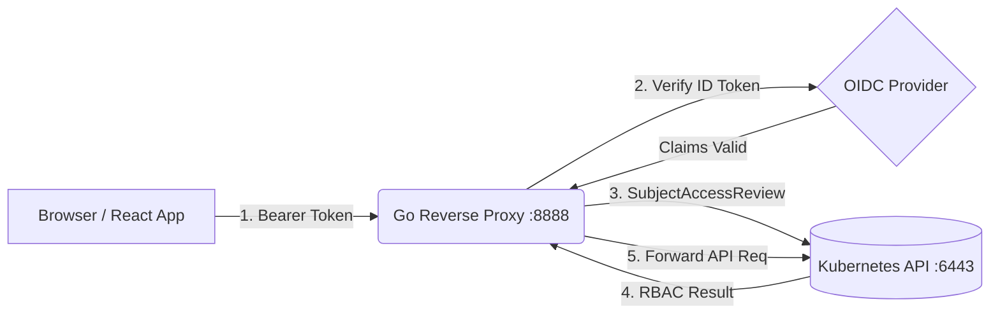

<div align="center">
  <h1>🛡️ KubeWarden: kube-auth-proxy</h1>
  <p><i>A pedagogical OIDC/RBAC Reverse Proxy for Kubernetes</i></p>
  
  [](https://goreportcard.com/report/github.com/harshitnub077/KubeWarden)
  [](https://opensource.org/licenses/MIT)
  [](https://reactjs.org/)
  [](https://golang.org/)
</div>

<br />

`kube-auth-proxy` is a specialized reverse proxy that sits between a browser-based frontend and the Kubernetes API Server. It authentically mirrors the behavior of production Kubernetes dashboards (like [Headlamp](https://github.com/kinvolk/headlamp)) by terminating OIDC authentication, evaluating precise Kubernetes RBAC permissions via `SubjectAccessReview`, and securely proxying authorized requests.

## 🏗️ Architecture



1. **Authentication**: Incoming requests to the proxy carry an OIDC Bearer token. The proxy extracts and cryptographically verifies the token against the configured OIDC Issuer.
2. **Impersonation**: Verified user claims (Email, Groups) are extracted and injected into the request as Kubernetes `Impersonate-User` and `Impersonate-Group` headers.
3. **RBAC Evaluation**: The `/api/permissions` endpoint asks the Kubernetes API's `authorization.k8s.io/v1.SubjectAccessReview` exactly what the verified user is allowed to do across key resources (including Dynamic Resource Allocation resources).
4. **Proxying**: Authorized traffic is securely forwarded via `httputil.ReverseProxy` to the actual Kubernetes API.

## 📂 Project Structure

```text
KubeWarden/
└── kube-auth-proxy/
    ├── backend/                 # The Go Reverse Proxy
    │   ├── main.go              # OIDC verifier & HTTP proxy setup
    │   ├── rbac.go              # SubjectAccessReview evaluation logic
    │   ├── go.mod               # Go module dependencies
    │   └── go.sum
    └── frontend/                # The React Dashboard
        ├── src/
        │   ├── App.tsx          # Permission matrix UI
        │   └── main.tsx         # React entrypoint
        ├── package.json         # Vite + React dependencies
        └── vite.config.ts
```

## ✨ Features

- **True Kubernetes RBAC Evaluation**: Doesn't guess permissions. It asks the K8s API directly via `SubjectAccessReview`.
- **Zero-Trust Proxying**: Enforces Identity Aware Proxying (IAP) via token verification before a request ever touches the cluster.
- **Dynamic Resource Allocation (DRA) Ready**: Explicitly checks permissions for emerging K8s concepts like `resourceclaims`, `deviceclasses`, and `resourceslices`.
- **Beautiful React Dashboard**: A sleek, Vite-powered UI that renders a ✅/❌ grid mapping User Roles to K8s Verbs & Resources.
- **Developer-Friendly Dev Mode**: Includes a local token bypass mechanism (`Bearer dev-token`) for instant local testing without spinning up a real Keycloak/Dex OIDC issuer.

## 🚀 Getting Started

### Prerequisites
- [Go](https://golang.org/dl/) 1.20+
- [Node.js](https://nodejs.org/en/download/) 18+
- Access to a local Kubernetes Cluster (e.g. `minikube`, `kind`, or `k3d`) to test real SubjectAccessReviews.

### 1. Start the Backend Proxy

```bash
cd kube-auth-proxy/backend
go mod download

# Start the proxy (Defaults to port :8888)
go run .
```

*Note: The backend reads your `~/.kube/config` automatically to locate the K8s API server.*

### 2. Start the Frontend Dashboard

Open a new terminal session:

```bash
cd kube-auth-proxy/frontend
npm install

# Start the Vite development server
npm run dev
```

### 3. Evaluate Permissions
Navigate to `http://localhost:5173`. In the token input, simply enter `dev-token` (our configured bypass token for local testing) and click **Evaluate RBAC**. You will see the matrix populate with the results of the `SubjectAccessReview`!

---
*Built with ❤️ for the Cloud Native ecosystem.*